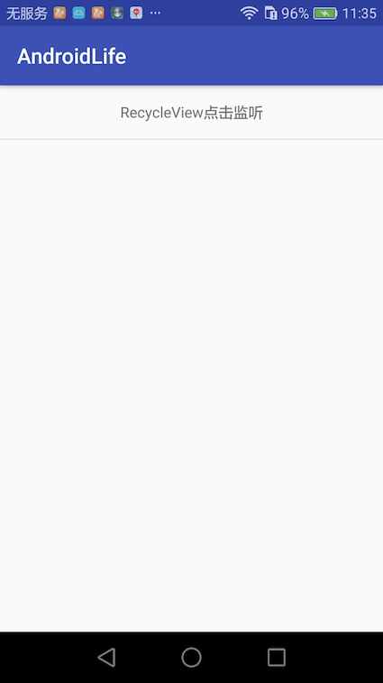

[博客地址](https://nesger.github.io/)
#### 背景
以前在展示列表时一直都是在使用ListView。

唯一的区别大概就是适配器Adapter的不同而已。

但是后来接触到了RecyclerView之后，就喜欢上了RecyclerView。

因此本篇打算说下RecyclerView的基本使用，给大家参考下。

正所谓“学以致用”，验明是否掌握了一门东西的最好方法是能够把这个东西讲给别人听，别人还能听懂。

所以基于此，本篇文章应运而生。

#### RecyclerView的好处
这里我就截取官网上的两段文字来说明。
>Many apps need to display user-interface elements based on large data sets, or data that frequently changes. For example, a music app might need to display information about thousands of albums, but only a dozen of those albums might be on-screen at a time. If the app created UI widgets for each of those albums, the app would end up using a lot of memory and storage, potentially making the app slow and crash-prone. On the other hand, if the app created UI widgets each time a new album scrolled onto the screen and destroyed the widgets when it scrolled off, that would also cause the app to run slowly, since creating UI objects is a resource-intensive operation.<br/>
To address this common situation, the Android Support Library provides the RecyclerView suite of objects. RecyclerView and its associated classes and interfaces help you to design and implement a dynamic user interface that runs efficiently. You can use these classes as they are, or customize them to suit your specific needs.

[传送门](https://developer.android.com/guide/topics/ui/layout/recyclerview.html)

>A flexible view for providing a limited window into a large data set.

[传送门](https://developer.android.com/reference/android/support/v7/widget/RecyclerView.html)

简单的说RecyclerView在显示**大量数据**的时候能起到高效的作用。

#### 实战
前面铺垫了那么多，接下来我们就实际看看一个最简单的RecyclerView如何撰写吧？

首先说明下RecyclerView的几大组成部分：

- RecyclerView本身
- 适配器Adapter（下面的例子为MainAdapter）
- ViewHolder（下面的例子为MainViewHolder）
- Item布局（下面的例子为item_main.xml）

这四个组成部分依赖关系是Item->ViewHolder->Adapter->RecyclerView

好了，接下来就让我们一步一步来实现一个展示文本的列表。

- 添加gradle依赖。在要使用的module的build.gradle文件中加入依赖。  

```
compile 'com.android.support:recyclerview-v7:26.+'
```

- 确定列表布局item_main.xml。这里列表展示的就是一个文本，所以只需要一个TextView即可。 
 
```
<?xml version="1.0" encoding="utf-8"?>
<TextView xmlns:android="http://schemas.android.com/apk/res/android"
    android:id="@+id/txt_title"
    android:layout_width="match_parent"
    android:layout_height="@dimen/dp_50"
    android:gravity="center"
    >
</TextView>
```  

- 创建列表布局的ViewHolder，继承自RecyclerView.ViewHolder，并初始化列表中的控件。

```
public class MainViewHolder extends RecyclerView.ViewHolder {

    @BindView(R.id.txt_title)
    TextView mTxtTitle;

    public MainViewHolder(View itemView) {
        super(itemView);
        ButterKnife.bind(this, itemView);
    }

}
```

这里使用了[butterknife](https://github.com/JakeWharton/butterknife)对TextView进行初始化。

- 创建适配器Adapter，继承自RecyclerView.Adapter<MainViewHolder> 。将数据源和布局文件通过Adapter联系起来。

```
public class MainAdapter extends RecyclerView.Adapter<MainViewHolder> {

    private Activity activity;
    private List<String> itemList;

    public MainAdapter(Activity activity, List<String> itemList) {
        if (activity == null || itemList == null) {
            throw new IllegalArgumentException("params can't be null");
        }
        this.activity = activity;
        this.itemList = itemList;
    }

    @Override
    public MainViewHolder onCreateViewHolder(ViewGroup parent, int viewType) {
        View view = LayoutInflater.from(parent.getContext()).inflate(R.layout.item_main, parent, false);
        return new MainViewHolder(view);
    }

    @Override
    public void onBindViewHolder(MainViewHolder holder, int position) {
        holder.mTxtTitle.setText(itemList.get(position));
    }

    @Override
    public int getItemCount() {
        return itemList.size();
    }
}
```

这里说明下几个方法：

1. 构造函数。用于对数据源进行初始化，以及传递activity进来。
2. onCreateViewHolder。使用item布局来初始化MainViewHolder。
3. onBindViewHolder。通过MainViewHolder获取到具体控件执行对应逻辑。
4. getItemCount。返回数据源的大小。

- 创建RecyclerView并进行初始化。

在使用RecyclerView的布局文件中加入下面代码：

```
<android.support.v7.widget.RecyclerView
        android:id="@+id/recycler_view"
        android:layout_width="match_parent"
        android:layout_height="match_parent"
        android:clipToPadding="false" />
```

初始化RecyclerView并将其与适配器绑定。

由于这里使用了butterknife，所以创建的时候就初始化了。

```
@BindView(R.id.recycler_view)
RecyclerView mRecyclerView;
private void initRecyclerView() {
        //设置子视图
        mRecyclerView.setLayoutManager(new LinearLayoutManager(this));
        //添加分割线
        mRecyclerView.addItemDecoration(new DividerItemDecoration(this, DividerItemDecoration.VERTICAL));
        //设置适配器
        mAdapter = new MainAdapter(this, mItemList);
        mRecyclerView.setAdapter(mAdapter);
    }
```

如此，一个简单的RecycleView就完成了。


***心动不如行动，赶紧自己去敲下代码熟悉下呗～***  
**[代码传送门](https://github.com/nesger/AndroidLife)**


